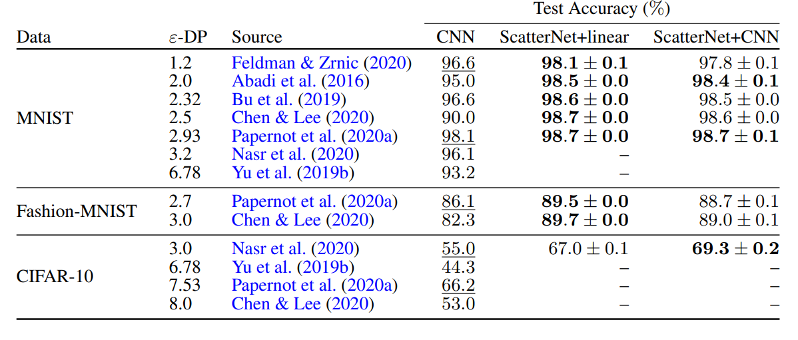

# DIFFERENTIALLY PRIVATE LEARNING NEEDS BETTER FEATURES (OR MUCH MORE DATA)

```console
@misc{tramèr2021differentially,
      title={Differentially Private Learning Needs Better Features (or Much More Data)}, 
      author={Florian Tramèr and Dan Boneh},
      year={2021},
      eprint={2011.11660},
      archivePrefix={arXiv},
      primaryClass={cs.LG}
}
```

## Introduction:

The paper discusses the importance of hand-crafted features with respect to privacy enabled machine learning, specifically differential privacy. 

## Contributions:

The paper proves the importance of hand-crafted features, they are able to support their claims with results, where they are able to:

* On CIFAR-10 they exceed the accuracy reported by Papernot et al. (2020b) while simultaneously improving the provable DP-guarantee by 130 times.
* On MNIST, they match the privacy-utility guarantees obtained with PATE (Papernot et al., 2018) without requiring access to any public data.

They are able to emperically support their statement by showing the test results for handcrafted scatternet predictions and previous work employing the same epsilon values.



### Discussion Points:

1. Learning Rate: Low lr leads to convergence with or without privacy.
2. Handcrafted Features: lead to faster convergence during non-private training and hence even while training with privacy, they are able to outperform non-handcrafted feature implementations.

Question is how to overcome performance gap between handcrafted and automated feature learning.

1. More data: They are able to reinforce the claim that more data could be an answer to outperforming handcrafted features. 
